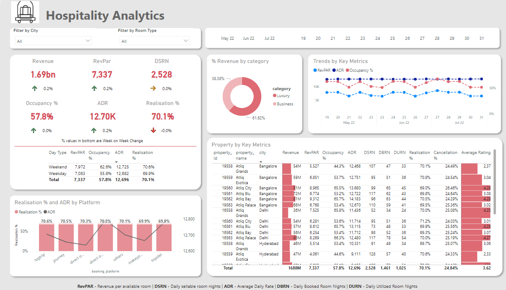
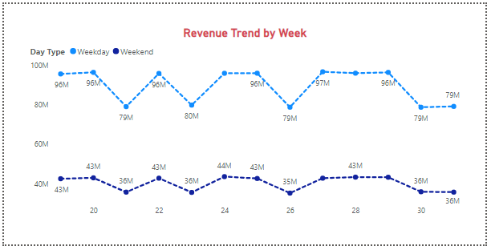

# 🏨 Hospitality Analytics Power BI Dashboard

Welcome to Hospitality Analytics, a Power BI solution delivering actionable insights for the hospitality industry.

## Project Overview

Hospitality Analytics combines sophisticated data transformation and metric calculation to provide in-depth insights for hotels and accommodations.

## Key Metrics and Visualizations

- **Revenue Metrics:** Calculated Revenue, RevPAR, ADR, DSRN, Realization, and Occupancy Percentage.
  - **Week-over-Week (WoW) Change:** Implemented WoW change for each revenue metric, visually enhanced with conditional formatting icons.

- **Visualizations:** Donut Chart, Line Chart, Stacked Chart, and Key Metrics Table.
  - **Tooltip Enhancement:** Added tooltips for detailed insights on each revenue metrics card.

- **Key Metrics Table:**
  - Includes essential metrics categorized by weekday and weekend for a comprehensive view of performance.

## Data Process

1. **Data Loading:**
   - Excel files loaded into Power BI.

2. **Transformation:**
   - Utilized Power Query for efficient data transformation.
   - Cleaned and structured raw data for analysis.

3. **Metrics Building:**
   - Key metrics calculated using DAX.

## 🚀 How to Explore

- **Download:** Access the Power BI file [here](Hospitality_Analytics.pbix).
- **Explore with Slicers and Filters:**
  - Utilize interactive slicers for City, Room Type, and Week Number to dynamically explore and analyze data.
  - Leverage conditional formatting icons on Week-over-Week Change for a quick visual assessment.

## Snapshot

 

Feel free to dive into this project and reach out for any questions or collaboration. Thank you for considering my portfolio! 🙌✨

